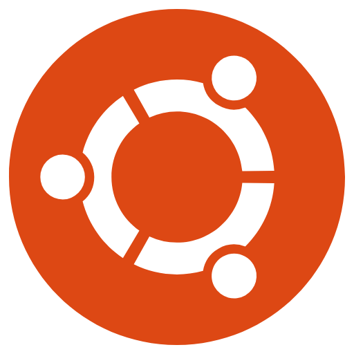
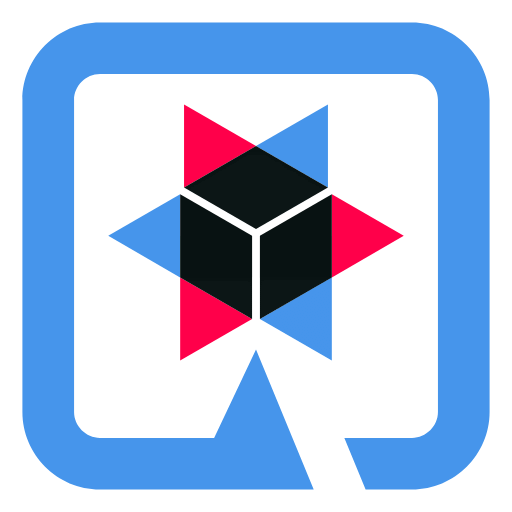
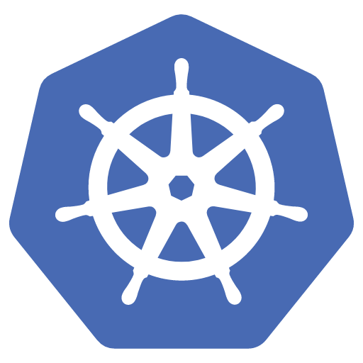
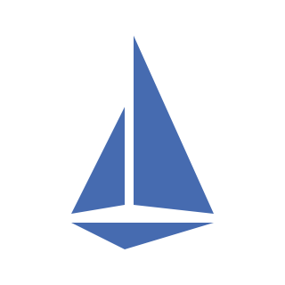
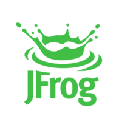
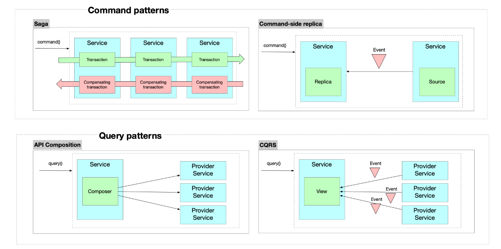
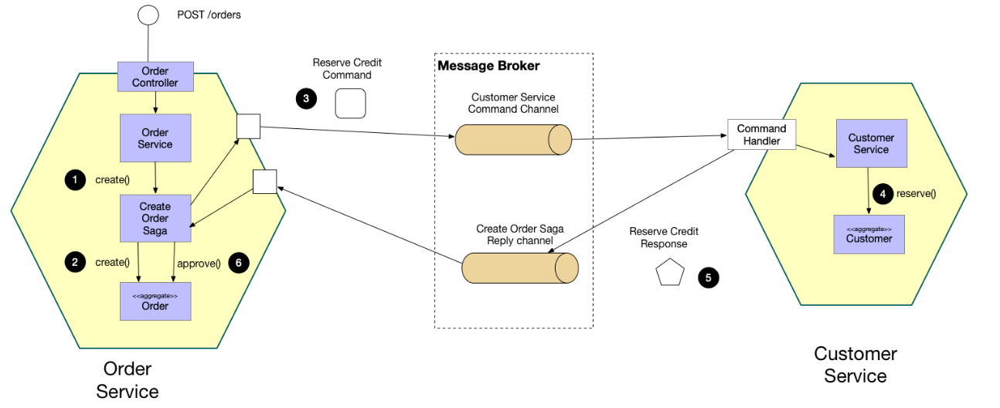
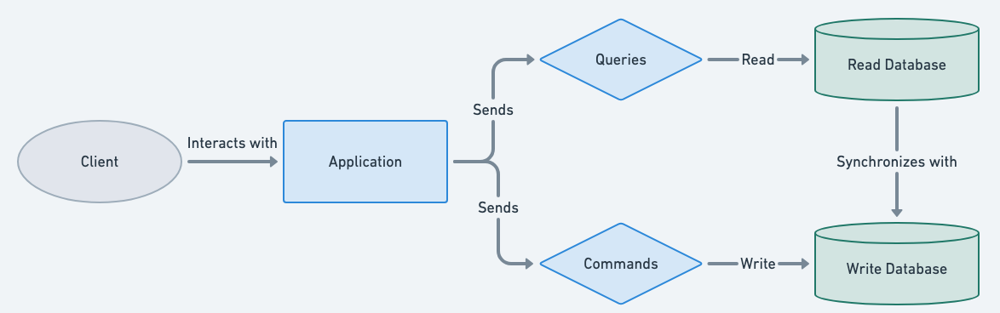

# Enterprise Platform

<p align="center">
  <strong>Plataforma Financeira Distribuída</strong>
</p>

<p align="center">
  Plataforma cloud-native baseada em microservices, projetada com foco em
  escalabilidade, resiliência, segurança, observabilidade e entrega contínua.
</p>

<p align="center">
  
  
  
  
  
  
  
  
  
  
  
  
  
  
  
  
  
  
  
  
</p>

<p align="center">
  
  
  
  
  
  
</p>

> **Documentação viva:** esta documentação encontra-se em evolução contínua e pode sofrer alterações conforme novos serviços, componentes, arquiteturas e capacidades são implementados.

---

## 📖 Visão Geral

O Laboratorio consiste na construção de uma Plataforma baseada em arquitetura de microservicos Java responsável por todo um ecossistema financeiro onde teremos gestão de contas, transações financeiras, pix, pagamentos, tesouraria, ledger contábil, auditoria, reconciliação, risco, scoring, canais digitais, notificações, identidade e segurança, integração com sistemas externos, processamento em lote, backoffice operacional, comunicação com app mobile, entre outros.

Ao todo serão desenvolvidos 25 serviços, onde estou trabalhando fortemente esta plataforma em ambientes cloud native, outra observação importante é que nao estao sendo utilizadas nenhuma API externa, afim de ter controle total da aplicação e suas transações.

Uma boa parte da solução funciona em arquitetura Java com processamento assíncrono e comunicação de mensageria com Apache Kafka, seguindo padronização SAGA e registro de eventos para fins regulatórios.

A infraestrutura é criada com Terraform, usando EKS, RDS, VPC, Vault entre outros serviços, suas pipelines automatizadas com GitHub Actions fazendo seu deploy automatico e monitoramento da saúde do cluster kubernetes com ArgoCD, além de coleta de metricas com Prometheus e sua visualização com Grafana. Ja na sua malha temos o istio (Service Mesh) para gerenciamento de tráfego L7 e controle de roteamento. Alem da utilização da infraestrutura AWS juntamente com uma infra GCP para backup por questão de segurança e de não depender de um único provedor.

Toda essa cautela de configuração e implatação foi pensada para ter um ambiente seguro, bem desenvolvido e com custo razoavel na nuvem, sendo mais umas das aplicações que estou desenvolvendo com muita atençao, alem do seu tamanho por serviço e do risco principalmente nas zonas de pagamento e transação que podem correr, pois cada configuração gera impacto financeiro.


## 🏗️ Princípios Arquiteturais

| Princípio | Descrição                                                                                                   |
|-----------|-------------------------------------------------------------------------------------------------------------|
| **Domain-Driven Design** | Decomposição de serviços orientada a domínios de negócio.                                                   |
| **Independent Deployment** | Cada serviço pode ser implantado independentemente.                                                         |
| **Event-Driven Communication** | Comunicação assíncrona baseada em eventos.                                                                  |
| **Distributed Transaction Coordination** | Coordenação de transações distribuídas com padrões como Saga Coreografada e Orquestrada com Outbox.         |
| **Resilience & Fault Isolation** | Isolamento de falhas e padrões de resiliência (Circuit Breaker, Retry, Bulkhead).                           |
| **Secure Service-to-Service** | Comunicação segura entre serviços com mTLS e autenticação mútua.                                            |
| **Centralized Observability** | Observabilidade centralizada com logs, métricas e traces distribuídos.                                      |
| **Infrastructure as Code** | Infraestrutura versionada e automatizada com Terraform.                                                     |
| **Automated CI/CD** | Pipelines de integração e entrega contínua automatizadas com verificação de imagens dos containers.         |
| **Cloud-Native Deployment** | Implantação em Kubernetes com escalabilidade automática juntamente com terraform em ambientes AWS e Google. |
| **Continuous Evolution** | Evolução contínua de capacidades de negócio.                                                                |

---

## 🏛️ Arquitetura da Plataforma

A plataforma segue uma arquitetura distribuída baseada em serviços independentes e capacidades de infraestrutura compartilhadas.

Na camada de aplicação, os serviços são organizados de acordo com suas responsabilidades de negócio.

Na camada de infraestrutura, a plataforma depende de Kubernetes, AWS, Terraform, rede e malhas de serviços, infraestrutura de mensageria, persistência e componentes de observabilidade.

A arquitetura foi projetada para permitir que serviços individuais escalem, evoluam e sejam implantados independentemente enquanto mantêm comunicação controlada entre domínios.

### High-Level Architecture

> **Diagrama de arquitetura será adicionado aqui.**


Os diagramas de arquitetura utilizados pelo projeto são mantidos como arquivos editáveis Draw.io e renderizados como imagens para fins de documentação.

### Camadas da Arquitetura

| Camada | Componentes | Responsabilidade |
|--------|-------|------------------|
| **API Gateway** | AWS API Gateway | Roteamento, rate limiting, autenticação e composição de APIs. |
| **Service Mesh** | Istio | Gerenciamento de tráfego, mTLS, observabilidade de serviço. |
| **Application Services** | Microservices Quarkus | Lógica de negócio e processamento de transações. |
| **Event Streaming** | Apache Kafka | Comunicação assíncrona e event sourcing. |
| **Data Persistence** | PostgreSQL, Redis | Persistência relacional e cache distribuído. |
| **Observability** | Prometheus, Grafana, Jaeger | Métricas, dashboards e distributed tracing. |
| **Infrastructure** | Kubernetes, AWS, Terraform | Orquestração, cloud e IaC. |

---

## 📦 Blocos de Serviços

A plataforma é organizada em grupos representando diferentes capacidades de negócio e técnicas.

### Core Banking

Serviços core banking fornecem capacidades fundamentais para gestão de contas, processamento de transações, operações de tesouraria, controle de acesso e governança operacional.

| Serviço | Responsabilidade |
|---------|------------------|
| **[contas](./core-banking-contas/README.md)** | Gestão de contas e operações de lifecycle de contas. |
| **[transacoes](./core-banking-transacoes/README.md)** | Processamento de transações e controle transacional. |
| **[tesouraria](./core-banking-tesouraria/README.md)** | Gestão de liquidez, posição financeira e operações de tesouraria. |
| **[canais](./core-banking-canais/README.md)** | Integração com canais de atendimento e clientes. |
| **[auditoria](./core-banking-auditoria/README.md)** | Trilha de auditoria, rastreabilidade operacional e accountability. |
| **[admin](./core-banking-admin/README.md)** | Administração da plataforma e gestão operacional. |
| **[iam](./core-banking-iam/README.md)** | Identidade, autenticação e autorização. |

---

### Serviços Financeiros

Serviços financeiros fornecem capacidades relacionadas a pagamentos, reconciliação, contabilidade, risco, scoring e limites operacionais.

| Serviço | Responsabilidade |
|---------|------------------|
| **[payments](./core-banking-payments/README.md)** | Processamento de pagamentos e gestão do lifecycle de pagamentos. |
| **[reconciliation](./core-banking-reconciliation/README.md)** | Reconciliação de eventos e movimentações financeiras. |
| **[risk](./core-banking-risk/README.md)** | Análise de risco e capacidades de gestão de risco. |
| **[ledger](./core-banking-ledger/README.md)** | Contabilidade transacional e gestão de ledger financeiro. |
| **[quota](./core-banking-quota/README.md)** | Limites operacionais, quotas e thresholds de autorização. |
| **[scoring](./core-banking-scoring/README.md)** | Avaliação e classificação de perfil de cliente e risco. |

---

### Customer & Operations

Estes serviços suportam experiência do cliente, operações internas, integrações externas e workflows de negócio distribuídos.

| Serviço | Responsabilidade |
|---------|------------------|
| **[notification](./core-banking-notification/README.md)** | Notificações e comunicação com clientes e sistemas. |
| **[reporting](./core-banking-reporting/README.md)** | Relatórios, visões analíticas e informações operacionais. |
| **[integration](./core-banking-integration/README.md)** | Integração com sistemas externos e parceiros. |
| **[consent](./core-banking-consent/README.md)** | Gestão de consentimento e controle de permissões. |
| **[kic](./core-banking-kic/README.md)** | Validação de informações de cliente e processos de conhecimento. |
| **[orchestration](./core-banking-orchestration/README.md)** | Coordenação de workflows distribuídos e processos multi-serviço. |
| **[customer-profile](./core-banking-customer-profile/README.md)** | Gestão de perfil de cliente e informações relacionadas. |
| **[backoffice](./core-banking-backoffice/README.md)** | Operações internas e suporte administrativo. |

---

### Platform Services

Serviços de plataforma fornecem capacidades compartilhadas necessárias para operar e evoluir o ecossistema bancário.

| Serviço | Responsabilidade |
|---------|------------------|
| **[data-platform](./core-banking-data-platform/README.md)** | Processamento de dados, analytics e capacidades de integração de informações. |
| **[config](./core-banking-config/README.md)** | Gestão centralizada de configurações. |
| **[batch](./core-banking-batch/README.md)** | Processamento agendado e operações em batch. |

---

# 🧭 Arquitetura, Fluxos e Diagramas da Plataforma

Esta seção apresenta os principais fluxos, componentes e decisões arquiteturais implementados na plataforma até o momento.
As imagens abaixo representam diferentes estágios de desenvolvimento e teste e destinam-se a fornecer evidência visual da plataforma operando com sucesso.

Os diagramas têm como objetivo facilitar a compreensão das interações entre serviços, infraestrutura e componentes da plataforma, servindo também como referência durante o desenvolvimento e evolução da arquitetura.

> A documentação é viva e pode ser atualizada continuamente a qualquer momento conforme novos serviços, integrações e componentes são implementados.

> Os screenshots são intencionalmente apresentados como evidência de implementação em vez de estarem atrelados a uma categoria específica de documentação. No entanto, 
cada serviço tem suas imagens e explicaçao em suas devidas configurações.

> Nota: Os padrões apresentados nesta seção representam apenas os principais conceitos arquiteturais utilizados na plataforma. A documentação completa de cada domínio pode conter outros padrões e estratégias específicas. Para conhecer as demais implementações, consulte os links disponíveis nas respectivas seções e documentações dos serviços.
## Backend e Desenvolvimento das Configurações

#### Padrões de Comunicação e Processamento Distribuído

A plataforma utiliza diferentes padrões arquiteturais para estruturar a comunicação entre microserviços, o processamento de comandos e a disponibilização de informações distribuídas.

Os padrões apresentados abaixo complementam a arquitetura orientada a eventos que vai permitir escolher diferentes estratégias de acordo com a natureza de cada fluxo de negócio.



----

#### Principal Logica da Arquitetura SAGA COREOGRAFADA


A plataforma utiliza o padrão **Saga Coreografada** para determinados fluxos distribuídos que envolvem múltiplos microserviços e operações de negócio que precisam manter **consistência eventual**.

Nesse modelo, não existe um componente central responsável por controlar toda a execução da Saga. Cada serviço participante é responsável por executar sua própria operação, publicar um evento ao concluir sua etapa e reagir aos eventos produzidos pelos demais participantes.

Essa abordagem mantém os serviços desacoplados e permite que cada domínio permaneça responsável pelas próprias regras de negócio.


---

#### Principal Logica da Arquitetura SAGA ORQUESTRADA

A plataforma tambem conta com SAGA Orchestrator, onde ele atua como coordenador central da Saga. Ele não executa diretamente as regras de negócio dos serviços participantes; sua responsabilidade é controlar a sequência de execução, acompanhar os resultados e determinar a próxima etapa do processo.



#### Essa abordagem permite que cada serviço permaneça responsável pelo seu próprio domínio, enquanto o Orchestrator mantém o controle do fluxo distribuído.


O fluxo apresentado representa uma implementação do padrão **Saga Orchestrator**, utilizada para coordenar uma operação distribuída entre diferentes serviços sem depender de uma transação única e global.

O processo é iniciado pelo **UserService**, que solicita ao **Orchestrator** o início da Saga. A partir desse momento, o Orchestrator assume a responsabilidade de coordenar as etapas do processo e controlar o estado da operação distribuída.

O fluxo é composto pelas seguintes etapas:

1. O **UserService** inicia a Saga e envia a solicitação ao **Orchestrator**.
2. O **Orchestrator** coordena as etapas necessárias para execução do processo.
3. O **AddressService** realiza o processamento relacionado ao endereço e pode interagir com o **DataService** para persistência ou consulta de dados.
4. O **ValidatedService** executa as validações necessárias para continuidade do fluxo.
5. O **UserRegistration** realiza a etapa de registro do usuário.
6. Quando todas as etapas são concluídas com sucesso, os serviços retornam o resultado ao **Orchestrator**, que consolida o sucesso da Saga.
7. Caso alguma etapa falhe, o **Orchestrator** identifica a falha e inicia o fluxo de tratamento correspondente, permitindo que o processo distribuído seja interrompido ou compensado conforme a estratégia definida.

---

#### Arquitetura orientada a eventos (EDA)

A plataforma utiliza **Event-Driven Architecture (EDA)** para promover comunicação assíncrona e desacoplada entre seus serviços.

No modelo **Fan-Out**, eventos publicados por diferentes produtores são encaminhados por um broker de eventos e disponibilizados para múltiplos consumidores independentes, permitindo processamento paralelo, escalabilidade e evolução desacoplada dos domínios.

> **Fan-Out:** um único evento pode desencadear múltiplos fluxos de processamento independentes dentro da plataforma.


Essa arquitetura ja esta sendo reutilizada de outro projeto como forma de reestruturaçao e reaproveitamento
da tecnologia ja implementada que se constitui como um Gateway de Pagamentos Assincronos, onde a solução tambem
foi construída com arquitetura orientada a eventos (EDA) e separada em dois 
microserviços principais: um serviço responsável por receber requisições de pagamento e
outro encarregado do processamento financeiro assíncrono. Já aqui na plataforma, ela tambem sera usada mais para seus respectivos problemas.

#### No Final de sua Comunicação Funcionará desta Forma

                    ENTERPRISE PLATFORM
                           │
                           ▼
                Event-Driven Architecture
                           │
                ┌──────────┴──────────┐
                ▼                     ▼
          Fan-Out Events        Distributed Transactions
                                      │
                             ┌────────┴────────┐
                             ▼                 ▼
                       Saga Coreografada   Saga Orquestrada
                             │                 │
                             ▼                 ▼
                       Event-driven       Orchestrator
                       coordination       coordination
---
## 📦 Deploy e Esteiras CI/CD

#### Principal Logica CI/CD Pipeline para proteção da imagens atualizadas no Container


### Pipeline de CI/CD

O projeto utiliza GitHub Actions para automação de CI/CD com os seguintes estágios:

```yaml
Stages:
  1. Build & Test
  2. Code Quality (SonarQube)
  3. Container Build
  4. Push to Artifactory
  5. Deploy to Dev (ArgoCD)
  6. Integration Tests
  7. Deploy to Staging
  8. Manual Approval
  9. Deploy to Production
```
Que a cada a cada git push nos repositórios:

GitHub Actions faz Build do projeto Java/Quarkus: mvn clean package -DskipTests mas validação das configurações críticas.
Empacotamento em Docker e push para GitHub Container Registry (GHCR), com tags baseadas no commit SHA.

Ja no Kubernetes os Manifests versionados (Deployment, Service, ConfigMap e Secrets) são atualizados automaticamente pelo pipeline.
Imagens são injetadas com tags imutáveis, garantindo que cada deploy seja reproduzível.
Estratégia de rollout configurada para zero downtime, com readinessProbe e livenessProbe para detectar falhas antes de substituir pods.

---
#### Deploy com Monitoramento do Cluster Kubernetes


Ja no ArgoCD ele vai detecta mudanças nos manifests e aplica sincronização automaticamente.
Gerencia drift do cluster onde qualquer pod fora do estado desejado é corrigido automaticamente. Assim, possibilitando rollback seguro para qualquer versão anterior, baseado no Git history.

Benefícios imediatos:

✅ Zero erro humano: Sem comandos de terminal manuais que podem falhar.

✅ Resiliência: Se o cluster cair, o ArgoCD garante que ele volte exatamente como estava no Git.

---

## Arquitetura de Comunicação
#### Diagrama de Mensageria com Apache Kafka dos primeiros serviços

Arquitetura de mensageria baseada em Apache Kafka, responsável pela comunicação assíncrona entre os domínios da plataforma, com suporte a eventos, retry, Dead Letter Queue (DLQ), Schema Registry e Outbox Pattern.

---

#### Consumo da Comunicação das Informações


---
## Malha de Serviço

#### Service Mesh com Istio
No decorer do desenvolvimento ficou perceptivel que atingir a escalabilidade exige mais do que conteinerização; exige o desacoplamento total entre a Lógica de Negócio e a Inteligência de Rede.
Com os primeiros domínios de Contas e Ledger operacionalizados e automatizados, o foco mudou para a resiliência da comunicação. Em um ambiente dinâmico com kubernetes, o acoplamento de rede via IPs ou lógicas de retry dentro do código Java gera débito técnico e risco de falhas em cascata.


⛵ Pensando nisso, a plataforma conta com o **[Istio Service Mesh](https://istio.io/latest/)** para garantir a alta disponibilidade, onde foi movido a complexidade operacional para o Data Plane (Envoy Proxies), permitindo que o Quarkus foque exclusivamente no domínio financeiro, onde podemos garantir:

🔹 Abstração de Service Discovery & DNS onde esta sendo implementando a resolução de nomes via CoreDNS nativo do K8s integrada ao Istio. O microserviço de Contas consome o Ledger através de um FQDN (Fully Qualified Domain Name), eliminando a volatilidade de IPs e garantindo o roteamento dinâmico.

🔹 Gerenciamento de Tráfego L7, através de VirtualServices e DestinationRules, a infraestrutura assume o controle de Retries, Timeouts e Circuit Breaking. Isso evita que o serviço consumidor fique preso em threads de espera caso o provedor apresente latência, preservando a saúde do cluster.

🔹 Load Balancing Inteligente, onde saímos do Round Robin simples para algoritmos de balanceamento que entendem a carga dos pods, garantindo a distribuição eficiente do tráfego e mitigando gargalos operacionais.

🔹 Estratégia de Persistência & Isolamento seguindo o pattern de Database-per-Service, cada domínio mantém seu estado isolado em instâncias distintas, garantindo que não haja acoplamento na camada de dados. A conectividade também passa pela governança da malha, onde pretendo implementar Egress Gateways para monitorar a performance e segurança das conexões externas com os bancos de dados na nuvem AWS RDS.

## Modelagem do Banco de Dados

#### CQRS (Command Query Responsibility Segregation)

A plataforma adota o padrão **CQRS** para separar as responsabilidades de leitura e escrita, permitindo otimização de consultas, escalabilidade e consistência eventual.




#### Exemplo do Banco de dados do Serviço de Transaçoes
Estruturado para suportar operações financeiras, idempotência, histórico transacional, transferências, eventos e rastreabilidade.

Diagrama da modelagem de tabelas do PostgreSQL que suporta o microsserviço de transações. ele é responsavel por armazenar os dominios de transaçoes, registro de intenções de movimentação, rastreabilidade de orquestração, estado do ciclo de vida financeiro, canais e métodos de captura, agenda temporal de disparos, histórico de tentativas e resiliência, regras de periodicidade e ciclos, agenda de próximos faturamentos, metadados etc.

---
#### Exemplo do Banco de dados do Serviço de Pagamento
Estruturado para suportar o ciclo de vida dos pagamentos, tentativas, idempotência, reconciliação, ledger e processamento assíncrono.

Diagrama da modelagem de tabelas do PostgreSQL que suporta o microsserviço de Pagamentos. Ele é responsável por armazenar as informaçoes dos boletos, pagamentos, gestao dos lotes, pagamentos recorrentes e assinaturas, NFC, fluxos das devoluçoes, identificação externa de atores, canais de liquidação, tarifas, taxas e custo de operação, registro de extorno e disputas etc.

---
## Infraestrutura Cloud


## 📊 Observabilidade

### Métricas (Prometheus + Grafana)

- **JVM Metrics**: Heap, GC, threads, CPU.
- **HTTP Metrics**: Request rate, latency, error rate.
- **Kafka Metrics**: Consumer lag, throughput, partitions.
- **Database Metrics**: Connections, query latency, locks.

### Distributed Tracing (Jaeger)

Todos os serviços incluem tracing distribuído para rastreamento de requisições entre serviços.

```java
@GET
@Path("/transactions/{id}")
@Timed(value = "transaction_get_duration", description = "Time to get transaction")
public Transaction getTransaction(@PathParam("id") String id) {
    // Tracing automático com Quarkus + Jaeger
    return transactionService.findById(id);
}
```

### Logs Centralizados (ELK Stack)

Logs estruturados em JSON são enviados para Elasticsearch e visualizados no Kibana.

```json
{
  "timestamp": "2026-08-15T18:39:00Z",
  "level": "INFO",
  "service": "contas",
  "trace_id": "abc123",
  "message": "Account created successfully",
  "account_id": "ACC-123456"
}
```

### Dashboards Grafana

- **Platform Overview**: Visão geral de saúde da plataforma.
- **Service Metrics**: Métricas por serviço (latência, throughput, erros).
- **Kafka Monitoring**: Lag de consumidores, throughput de tópicos.
- **Business Metrics**: Transações por segundo, contas abertas, pagamentos processados.

---

## 🔒 Segurança

### Autenticação e Autorização

- **OAuth2 / OIDC** com Keycloak para autenticação centralizada.
- **JWT Tokens** para autenticação stateless entre serviços.
- **RBAC** (Role-Based Access Control) para controle de acesso granular.

### Service-to-Service Security

- **mTLS** para autenticação mútua entre serviços.
- **Istio Authorization Policies** para controle de tráfego entre serviços.
- **Vault** para gestão de secrets e credenciais.

### Compliance

- **LGPD / GDPR**: Proteção de dados pessoais e privacidade.
- **PCI-DSS**: Segurança de dados de cartões de pagamento.
- **SOC 2**: Controles de segurança e disponibilidade.

---

> Evidências adicionais de implementação e resultados de validação específicos de serviços serão progressivamente adicionados conforme a plataforma evolui.

## 🧪 Testes

### Estratégia de Testes

| Tipo de Teste | Ferramenta | Cobertura |
|---------------|------------|-----------|
| **Unit Tests** | JUnit 5, Mockito | 80%+ |
| **Integration Tests** | Testcontainers, Quarkus Test | 70%+ |
| **Contract Tests** | Pact | APIs críticas |
| **End-to-End Tests** | REST Assured | Fluxos principais |
| **Performance Tests** | k6, JMeter | Cenários de carga |
| **Security Tests** | OWASP ZAP, Snyk | Vulnerabilidades |

### Executando Testes

```bash
# Testes unitários
mvn test

# Testes de integração
mvn verify -Pintegration

# Testes de contrato
mvn test -Pcontract-tests

# Análise de cobertura
mvn test jacoco:report
```

---

### Padrões de Código

- **Java Code Style**: Seguir convenções Oracle Java.
- **Commit Messages**: Seguir [Conventional Commits](https://www.conventionalcommits.org/).
- **Code Review**: Todos os PRs requerem aprovação de pelo menos 1 reviewer.

### Documentação de Serviços

Cada serviço deve manter sua própria documentação no repositório individual incluindo:

- Visão geral e responsabilidades.
- API endpoints (OpenAPI/Swagger).
- Dependências e interfaces.
- Instruções de setup local.
- Variáveis de ambiente.
- Exemplos de uso.

---

## 📄 Licença

Copyright © 2026 **Your Organization**. Todos os direitos reservados.

---

<div align="center">

**Enterprise Banking Platform** | Cloud-Native • Microservices • Event-Driven • Resilient

Made with ☕ Java + Quarkus | 🚀 Kubernetes | 📊 Kafka

</div>