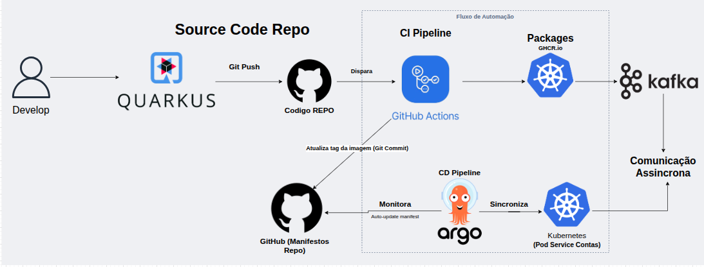
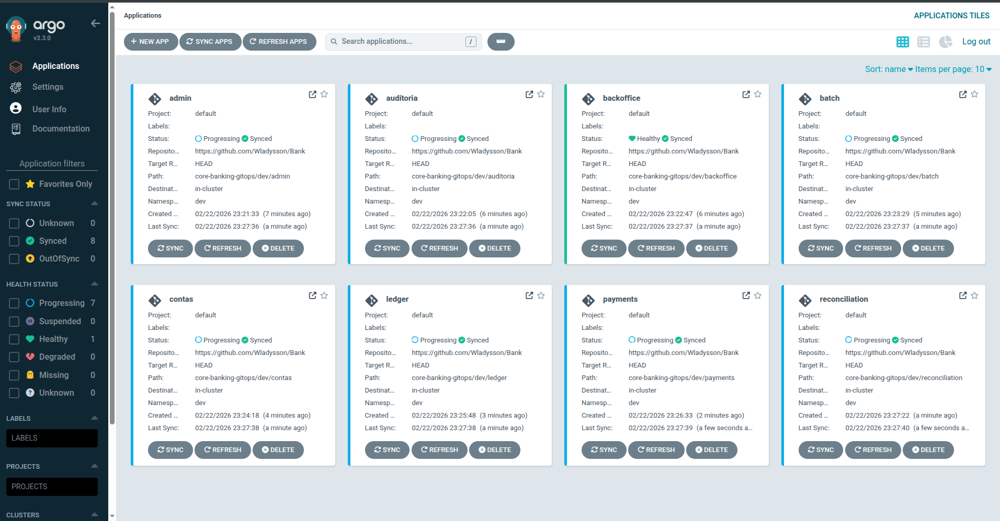
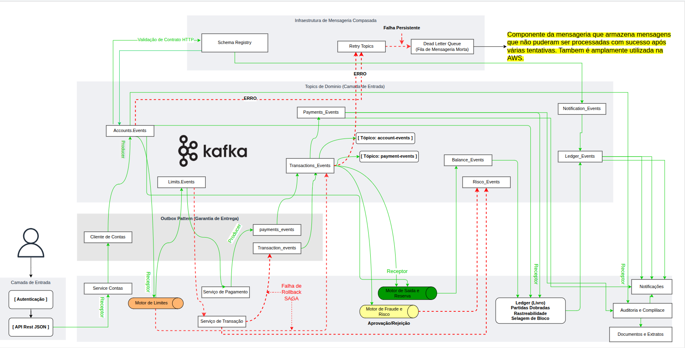
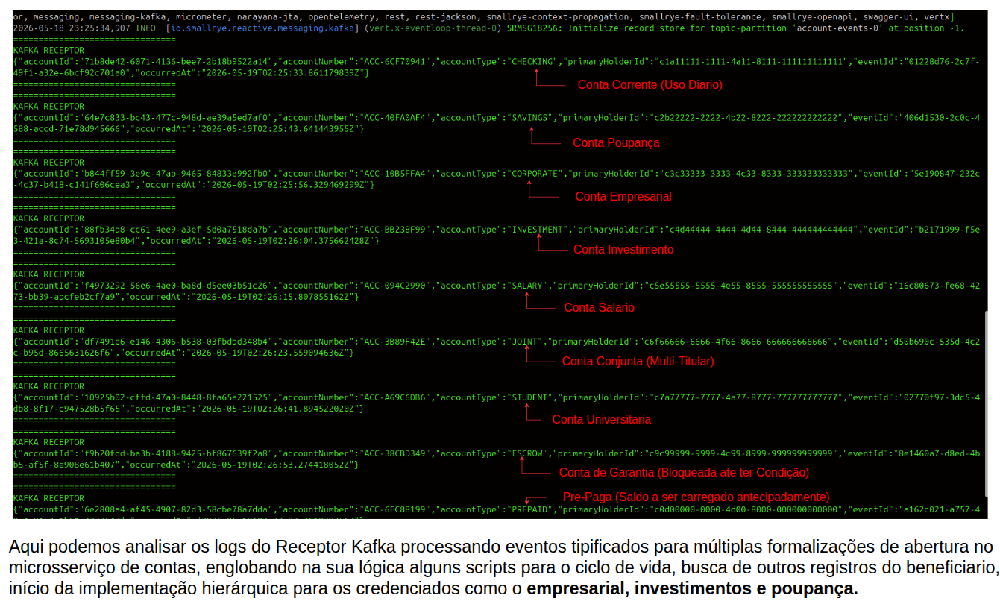

# Enterprise Platform

> Plataforma bancária distribuída projetada com arquitetura cloud-native baseada em microservices, focada em escalabilidade, resiliência, segurança, observabilidade e entrega contínua.

> Observação: Essa documentaçao é viva e pode sofre modificaçoes constantemente.

[](LICENSE)
[](https://openjdk.org/)
[](https://quarkus.io/)
[](https://kubernetes.io/)
[](https://github.com/your-org/bank-platform/actions)

## 📖 Visão Geral

Este projeto se destaca como uma plataforma bancária, composta por serviços independentemente implantáveis organizados em torno de domínios de negócio e capacidades da plataforma.

A plataforma foi projetada para suportar operações financeiras distribuídas mantendo limites de domínio claros, autonomia de serviços e resiliência operacional.

Sua arquitetura combina práticas de desenvolvimento de aplicações com infraestrutura cloud-native desenvolvimento Java, comunicação orientada a eventos, observabilidade e pipelines de entrega automatizados.

O projeto está sendo desenvolvido como um ecossistema bancário modular, onde cada serviço é responsável por uma capacidade de negócio específica e pode evoluir independentemente enquanto se comunica com o restante da plataforma através de interfaces e eventos bem definidos.

### Casos de Uso

- **Open Banking**: Integração com ecossistema financeiros e criaçao de APIS proprias da plataforma sem utilizaçao de terceiros.
- **Pagamentos Digitais**: Processamento de transações PIX, TED, boletos e cartões.
- **Gestão de Contas**: Abertura, manutenção e encerramento de contas digitais.
- **Conciliação Financeira**: Reconciliação automática de eventos e movimentações financeiras.
- **Risk & Compliance**: Análise de risco, scoring e conformidade regulatória.
- **Treasury Operations**: Gestão de liquidez, posição financeira e operações de tesouraria.

---

## 🏗️ Princípios Arquiteturais

| Princípio | Descrição                                                                                                   |
|-----------|-------------------------------------------------------------------------------------------------------------|
| **Domain-Driven Design** | Decomposição de serviços orientada a domínios de negócio.                                                   |
| **Independent Deployment** | Cada serviço pode ser implantado independentemente.                                                         |
| **Event-Driven Communication** | Comunicação assíncrona baseada em eventos.                                                                  |
| **Distributed Transaction Coordination** | Coordenação de transações distribuídas com padrões como Saga Coreografada e Orquestrada com Outbox.         |
| **Resilience & Fault Isolation** | Isolamento de falhas e padrões de resiliência (Circuit Breaker, Retry, Bulkhead).                           |
| **Secure Service-to-Service** | Comunicação segura entre serviços com mTLS e autenticação mútua.                                            |
| **Centralized Observability** | Observabilidade centralizada com logs, métricas e traces distribuídos.                                      |
| **Infrastructure as Code** | Infraestrutura versionada e automatizada com Terraform.                                                     |
| **Automated CI/CD** | Pipelines de integração e entrega contínua automatizadas com verificação de imagens dos containers.         |
| **Cloud-Native Deployment** | Implantação em Kubernetes com escalabilidade automática juntamente com terraform em ambientes AWS e Google. |
| **Continuous Evolution** | Evolução contínua de capacidades de negócio.                                                                |

---

## 🏛️ Arquitetura da Plataforma

A plataforma segue uma arquitetura distribuída baseada em serviços independentes e capacidades de infraestrutura compartilhadas.

Na camada de aplicação, os serviços são organizados de acordo com suas responsabilidades de negócio.

Na camada de infraestrutura, a plataforma depende de Kubernetes, AWS, Terraform, rede e malhas de serviços, infraestrutura de mensageria, persistência e componentes de observabilidade.

A arquitetura foi projetada para permitir que serviços individuais escalem, evoluam e sejam implantados independentemente enquanto mantêm comunicação controlada entre domínios.

### High-Level Architecture

> **Diagrama de arquitetura será adicionado aqui.**


Os diagramas de arquitetura utilizados pelo projeto são mantidos como arquivos editáveis Draw.io e renderizados como imagens para fins de documentação.

### Camadas da Arquitetura

| Camada | Componentes | Responsabilidade |
|--------|-------|------------------|
| **API Gateway** | AWS API Gateway | Roteamento, rate limiting, autenticação e composição de APIs. |
| **Service Mesh** | Istio | Gerenciamento de tráfego, mTLS, observabilidade de serviço. |
| **Application Services** | Microservices Quarkus | Lógica de negócio e processamento de transações. |
| **Event Streaming** | Apache Kafka | Comunicação assíncrona e event sourcing. |
| **Data Persistence** | PostgreSQL, Redis | Persistência relacional e cache distribuído. |
| **Observability** | Prometheus, Grafana, Jaeger | Métricas, dashboards e distributed tracing. |
| **Infrastructure** | Kubernetes, AWS, Terraform | Orquestração, cloud e IaC. |

---

## 📦 Blocos de Serviços

A plataforma é organizada em grupos representando diferentes capacidades de negócio e técnicas.

### Core Banking

Serviços core banking fornecem capacidades fundamentais para gestão de contas, processamento de transações, operações de tesouraria, controle de acesso e governança operacional.

| Serviço | Responsabilidade | Link |
|---------|------------------|------|
| **[contas](https://github.com/your-org/bank-contas)** | Gestão de contas e operações de lifecycle de contas. | [🔗](https://github.com/your-org/bank-contas) |
| **[transacoes](https://github.com/your-org/bank-transacoes)** | Processamento de transações e controle transacional. | [🔗](https://github.com/your-org/bank-transacoes) |
| **[tesouraria](https://github.com/your-org/bank-tesouraria)** | Gestão de liquidez, posição financeira e operações de tesouraria. | [🔗](https://github.com/your-org/bank-tesouraria) |
| **[canais](https://github.com/your-org/bank-canais)** | Integração com canais de atendimento e clientes. | [🔗](https://github.com/your-org/bank-canais) |
| **[auditoria](https://github.com/your-org/bank-auditoria)** | Trilha de auditoria, rastreabilidade operacional e accountability. | [🔗](https://github.com/your-org/bank-auditoria) |
| **[admin](https://github.com/your-org/bank-admin)** | Administração da plataforma e gestão operacional. | [🔗](https://github.com/your-org/bank-admin) |
| **[iam](https://github.com/your-org/bank-iam)** | Identidade, autenticação e autorização. | [🔗](https://github.com/your-org/bank-iam) |

---

### Serviços Financeiros

Serviços financeiros fornecem capacidades relacionadas a pagamentos, reconciliação, contabilidade, risco, scoring e limites operacionais.

| Serviço | Responsabilidade | Link |
|---------|------------------|------|
| **[payments](https://github.com/your-org/bank-payments)** | Processamento de pagamentos e gestão do lifecycle de pagamentos. | [🔗](https://github.com/your-org/bank-payments) |
| **[reconciliation](https://github.com/your-org/bank-reconciliation)** | Reconciliação de eventos e movimentações financeiras. | [🔗](https://github.com/your-org/bank-reconciliation) |
| **[risk](https://github.com/your-org/bank-risk)** | Análise de risco e capacidades de gestão de risco. | [🔗](https://github.com/your-org/bank-risk) |
| **[ledger](https://github.com/your-org/bank-ledger)** | Contabilidade transacional e gestão de ledger financeiro. | [🔗](https://github.com/your-org/bank-ledger) |
| **[quota](https://github.com/your-org/bank-quota)** | Limites operacionais, quotas e thresholds de autorização. | [🔗](https://github.com/your-org/bank-quota) |
| **[scoring](https://github.com/your-org/bank-scoring)** | Avaliação e classificação de perfil de cliente e risco. | [🔗](https://github.com/your-org/bank-scoring) |

---

### Customer & Operations

Estes serviços suportam experiência do cliente, operações internas, integrações externas e workflows de negócio distribuídos.

| Serviço | Responsabilidade | Link |
|---------|------------------|------|
| **[notification](https://github.com/your-org/bank-notification)** | Notificações e comunicação com clientes e sistemas. | [🔗](https://github.com/your-org/bank-notification) |
| **[reporting](https://github.com/your-org/bank-reporting)** | Relatórios, visões analíticas e informações operacionais. | [🔗](https://github.com/your-org/bank-reporting) |
| **[integration](https://github.com/your-org/bank-integration)** | Integração com sistemas externos e parceiros. | [🔗](https://github.com/your-org/bank-integration) |
| **[consent](https://github.com/your-org/bank-consent)** | Gestão de consentimento e controle de permissões. | [🔗](https://github.com/your-org/bank-consent) |
| **[kic](https://github.com/your-org/bank-kic)** | Validação de informações de cliente e processos de conhecimento. | [🔗](https://github.com/your-org/bank-kic) |
| **[orchestration](https://github.com/your-org/bank-orchestration)** | Coordenação de workflows distribuídos e processos multi-serviço. | [🔗](https://github.com/your-org/bank-orchestration) |
| **[customer-profile](https://github.com/your-org/bank-customer-profile)** | Gestão de perfil de cliente e informações relacionadas. | [🔗](https://github.com/your-org/bank-customer-profile) |
| **[backoffice](https://github.com/your-org/bank-backoffice)** | Operações internas e suporte administrativo. | [🔗](https://github.com/your-org/bank-backoffice) |

---

### Platform Services

Serviços de plataforma fornecem capacidades compartilhadas necessárias para operar e evoluir o ecossistema bancário.

| Serviço | Responsabilidade | Link |
|---------|------------------|------|
| **[data-platform](https://github.com/your-org/bank-data-platform)** | Processamento de dados, analytics e capacidades de integração de informações. | [🔗](https://github.com/your-org/bank-data-platform) |
| **[config](https://github.com/your-org/bank-config)** | Gestão centralizada de configurações. | [🔗](https://github.com/your-org/bank-config) |
| **[batch](https://github.com/your-org/bank-batch)** | Processamento agendado e operações em batch. | [🔗](https://github.com/your-org/bank-batch) |

---

## 🛠️ Stack Tecnológico

### Application

| Tecnologia | Propósito | Versão |
|------------|-----------|--------|
| **Java** | Linguagem primária de aplicação. | 17+ |
| **Quarkus** | Framework Java cloud-native para serviços backend. | 3.x |
| **Maven** | Gerenciamento de dependências e build. | 3.9+ |

### Data & Messaging

| Tecnologia | Propósito | Versão |
|------------|-----------|--------|
| **PostgreSQL** | Persistência relacional. | 15+ |
| **Apache Kafka** | Event streaming e comunicação assíncrona. | 3.5+ |
| **Redis** | Cache distribuído e sessões. | 7+ |

### Cloud & Infrastructure

| Tecnologia | Propósito | Versão |
|------------|-----------|--------|
| **AWS** | Infraestrutura cloud e serviços gerenciados. | - |
| **Kubernetes** | Orquestração de containers e implantação de serviços. | 1.27+ |
| **Terraform** | Infrastructure as Code. | 1.5+ |
| **Helm** | Gerenciamento de pacotes Kubernetes. | 3.12+ |

### Observability

| Tecnologia | Propósito | Versão |
|------------|-----------|--------|
| **Prometheus** | Coleta de métricas e monitoramento. | 2.45+ |
| **Grafana** | Visualização de métricas e dashboards operacionais. | 10.x |
| **Jaeger** | Distributed tracing. | 1.48+ |
| **ELK Stack** | Centralização e análise de logs. | 8.x |

### DevOps & Delivery

| Tecnologia | Propósito | Versão |
|------------|-----------|--------|
| **GitHub Actions** | Integração contínua e pipelines de automação. | - |
| **ArgoCD** | Continuous delivery baseado em GitOps. | 2.9+ |
| **JFrog Artifactory** | Gerenciamento e distribuição de artefatos. | 7.x |
| **SonarQube** | Análise estática de código e qualidade. | 10.x |

### Service Networking

| Tecnologia | Propósito | Versão |
|------------|-----------|--------|
| **Istio** | Service mesh, gerenciamento de tráfego e governança service-to-service. | 1.18+ |

### Security

| Tecnologia | Propósito | Versão |
|------------|-----------|--------|
| **Keycloak** | Identity and Access Management. | 22+ |
| **Vault** | Gestão de secrets e criptografia. | 1.14+ |
| **mTLS** | Autenticação mútua entre serviços. | - |

---

### Padrões de Event-Driven

| Padrão | Descrição | Uso |
|--------|-----------|-----|
| **Event Sourcing** | Estado derivado de sequência de eventos. | Ledger, auditoria. |
| **CQRS** | Separação de leitura e escrita. | Reporting, consultas. |
| **Saga Pattern** | Coordenação de transações distribuídas. | Pagamentos, transações. |
| **Outbox Pattern** | Publicação confiável de eventos. | Integração com Kafka. |
| **Event Carried State Transfer** | Propagação de estado via eventos. | Sincronização entre serviços. |

### Tópicos Kafka Principais

| Tópico | Descrição | Partições | Retenção |
|--------|-----------|-----------|----------|
| `transactions.events` | Eventos de transações financeiras. | 12 | 7 dias |
| `payments.events` | Eventos de processamento de pagamentos. | 12 | 7 dias |
| `accounts.events` | Eventos de lifecycle de contas. | 6 | 7 dias |
| `customer.events` | Eventos de perfil e dados de cliente. | 6 | 7 dias |
| `audit.events` | Eventos de auditoria e compliance. | 12 | 30 dias |

---
### Pré-requisitos das Configurações Principais

- **Java 17+** ([OpenJDK](https://openjdk.org/))
- **Maven 3.9+** ([Download](https://maven.apache.org/))
- **Docker 24+** ([Install](https://docs.docker.com/))
- **Kubernetes 1.27+** ([Minikube](https://minikube.sigs.k8s.io/) ou [kind](https://kind.sigs.k8s.io/))
- **PostgreSQL 15+** ([Download](https://www.postgresql.org/))
- **Apache Kafka 3.5+** ([Download](https://kafka.apache.org/))
- **Git** ([Install](https://git-scm.com/))

## 📦 Deploy e CI/CD

#### Principal Logica CI/CD Pipeline para proteção da imagens atualizadas



### Pipeline de CI/CD

O projeto utiliza GitHub Actions para automação de CI/CD com os seguintes estágios:

```yaml
Stages:
  1. Build & Test
  2. Code Quality (SonarQube)
  3. Container Build
  4. Push to Artifactory
  5. Deploy to Dev (ArgoCD)
  6. Integration Tests
  7. Deploy to Staging
  8. Manual Approval
  9. Deploy to Production
```

Que a cada a cada git push nos repositórios:

GitHub Actions faz Build do projeto Java/Quarkus: mvn clean package -DskipTests mas validação das configurações críticas.
Empacotamento em Docker e push para GitHub Container Registry (GHCR), com tags baseadas no commit SHA.

Ja no Kubernetes os Manifests versionados (Deployment, Service, ConfigMap e Secrets) são atualizados automaticamente pelo pipeline.
Imagens são injetadas com tags imutáveis, garantindo que cada deploy seja reproduzível.
Estratégia de rollout configurada para zero downtime, com readinessProbe e livenessProbe para detectar falhas antes de substituir pods.

---
### Deploy com Monitoramento do Cluster Kubernetes ArgoCD


Ja no ArgoCD ele vai detecta mudanças nos manifests e aplica sincronização automaticamente.
Gerencia drift do cluster onde qualquer pod fora do estado desejado é corrigido automaticamente. Assim, possibilitando rollback seguro para qualquer versão anterior, baseado no Git history.

Benefícios imediatos:

✅ Zero erro humano: Sem comandos de terminal manuais que podem falhar.

✅ Resiliência: Se o cluster cair, o ArgoCD garante que ele volte exatamente como estava no Git.

### Helm Charts

A plataforma é implantada usando Helm charts localizados em `helm/`:

```bash
# Instale a plataforma
helm install bank-platform ./helm/bank-platform \
  --namespace bank \
  --create-namespace \
  --values ./helm/bank-platform/values-prod.yaml
```
---

## Arquitetura de Comunicação
#### Mensageria com Apache Kafka dos primeiros serviços


### Consumo da Comunicação das Informações


### Service Mesh com Istio na Malha dos Serviços

## Relacionamento e Modelagem do Banco de Dados

## 📊 Observabilidade

### Métricas (Prometheus + Grafana)

- **JVM Metrics**: Heap, GC, threads, CPU.
- **HTTP Metrics**: Request rate, latency, error rate.
- **Kafka Metrics**: Consumer lag, throughput, partitions.
- **Database Metrics**: Connections, query latency, locks.

### Distributed Tracing (Jaeger)

Todos os serviços incluem tracing distribuído para rastreamento de requisições entre serviços.

```java
@GET
@Path("/transactions/{id}")
@Timed(value = "transaction_get_duration", description = "Time to get transaction")
public Transaction getTransaction(@PathParam("id") String id) {
    // Tracing automático com Quarkus + Jaeger
    return transactionService.findById(id);
}
```

### Logs Centralizados (ELK Stack)

Logs estruturados em JSON são enviados para Elasticsearch e visualizados no Kibana.

```json
{
  "timestamp": "2026-08-15T18:39:00Z",
  "level": "INFO",
  "service": "contas",
  "trace_id": "abc123",
  "message": "Account created successfully",
  "account_id": "ACC-123456"
}
```

### Dashboards Grafana

- **Platform Overview**: Visão geral de saúde da plataforma.
- **Service Metrics**: Métricas por serviço (latência, throughput, erros).
- **Kafka Monitoring**: Lag de consumidores, throughput de tópicos.
- **Business Metrics**: Transações por segundo, contas abertas, pagamentos processados.

---

## 🔒 Segurança

### Autenticação e Autorização

- **OAuth2 / OIDC** com Keycloak para autenticação centralizada.
- **JWT Tokens** para autenticação stateless entre serviços.
- **RBAC** (Role-Based Access Control) para controle de acesso granular.

### Service-to-Service Security

- **mTLS** para autenticação mútua entre serviços.
- **Istio Authorization Policies** para controle de tráfego entre serviços.
- **Vault** para gestão de secrets e credenciais.

### Compliance

- **LGPD / GDPR**: Proteção de dados pessoais e privacidade.
- **PCI-DSS**: Segurança de dados de cartões de pagamento.
- **SOC 2**: Controles de segurança e disponibilidade.

---

## 🧪 Testes

### Estratégia de Testes

| Tipo de Teste | Ferramenta | Cobertura |
|---------------|------------|-----------|
| **Unit Tests** | JUnit 5, Mockito | 80%+ |
| **Integration Tests** | Testcontainers, Quarkus Test | 70%+ |
| **Contract Tests** | Pact | APIs críticas |
| **End-to-End Tests** | REST Assured | Fluxos principais |
| **Performance Tests** | k6, JMeter | Cenários de carga |
| **Security Tests** | OWASP ZAP, Snyk | Vulnerabilidades |

### Executando Testes

```bash
# Testes unitários
mvn test

# Testes de integração
mvn verify -Pintegration

# Testes de contrato
mvn test -Pcontract-tests

# Análise de cobertura
mvn test jacoco:report
```

---

## 🏆 Engineering Showcase

A seção a seguir apresenta resultados selecionados de execução, implementação e validação da plataforma.

As imagens abaixo representam diferentes estágios de desenvolvimento e teste e destinam-se a fornecer evidência visual da plataforma operando com sucesso.

> Os screenshots são intencionalmente apresentados como evidência de implementação em vez de estarem atrelados a uma categoria específica de documentação.
---

### Implementation Evidence

#### Platform Execution


---

#### Service Execution


---

#### API and Integration Validation


---

#### Automated Tests


---

#### Distributed Communication


---

#### Infrastructure Execution


---

#### Observability


---


> Evidências adicionais de implementação e resultados de validação específicos de serviços serão progressivamente adicionados conforme a plataforma evolui.

---

### Padrões de Código

- **Java Code Style**: Seguir convenções Oracle Java.
- **Commit Messages**: Seguir [Conventional Commits](https://www.conventionalcommits.org/).
- **Code Review**: Todos os PRs requerem aprovação de pelo menos 1 reviewer.

### Documentação de Serviços

Cada serviço deve manter sua própria documentação no repositório individual incluindo:

- Visão geral e responsabilidades.
- API endpoints (OpenAPI/Swagger).
- Dependências e interfaces.
- Instruções de setup local.
- Variáveis de ambiente.
- Exemplos de uso.

---

## 📄 Licença

Copyright © 2026 **Your Organization**. Todos os direitos reservados.

---

<div align="center">

**Enterprise Banking Platform** | Cloud-Native • Microservices • Event-Driven • Resilient

Made with ☕ Java + Quarkus | 🚀 Kubernetes | 📊 Kafka

</div>