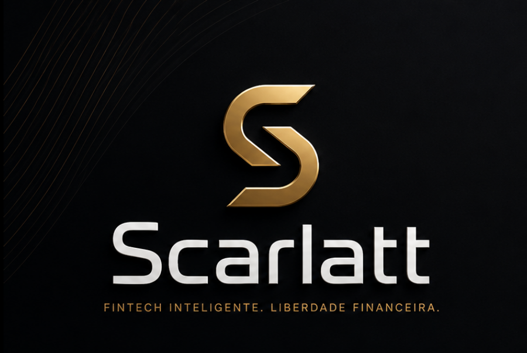

# Plataforma Financeira 

## Visão geral

Este repositório representa uma arquitetura distribuída composta por serviços especializados, desenhados para escalabilidade, resiliência, rastreabilidade e evolução independente de cada domínio de negócio.

A plataforma foi estruturada para suportar operações como gestão de contas, transações, tesouraria, cartões, pagamentos, conciliação, risco, auditoria, consentimento, integração e processamento em lote, com suporte a orquestração e observabilidade ponta a ponta.

Onde não olhamos para o dinheiro apenas como um saldo que muda de mãos, mas como o combustível. Unimos tecnologia de ponta, segurança e inteligência de dados para criar um ecossistema financeiro completo e acessível.

## Arquitetura

- Arquitetura baseada em microsserviços.
- Comunicação síncrona e assíncrona entre serviços.
- Processamento orientado a eventos com Kafka.
- Deploy e operação em Kubernetes.
- Observabilidade com Prometheus e Grafana.
- Service mesh com Istio.
- Estratégias de consistência distribuída com Saga Pattern.
- Provisionamento de infraestrutura com Terraform.
- GitOps e entrega contínua com ArgoCD.
- Pipelines de automação com GitHub Actions.

## Serviços

- **contas** — serviço responsável pela gestão de contas.
- **transacoes** — processamento e controle de transações.
- **tesouraria** — gestão de liquidez, posição financeira e operações de tesouraria.
- **cartoes** — domínio de emissão, controle e processamento de cartões.
- **canais** — integração com canais de atendimento e consumo.
- **auditoria** — trilha de auditoria e rastreabilidade operacional.
- **admin** — administração da plataforma e funções operacionais.
- **iam** — identidade, autenticação e autorização.

### Financeiro

- **payments** — processamento de pagamentos.
- **reconciliation** — conciliação de eventos e movimentos financeiros.
- **risk** — análise e gestão de risco.
- **ledger** — escrituração e controle contábil transacional.
- **quota** — gestão de limites, cotas ou alçadas operacionais.
- **scoring** — avaliação e classificação de perfil/risco.

### Suporte e experiência

- **notification** — envio de notificações e comunicação com clientes ou sistemas.
- **reporting** — geração de relatórios e visões analíticas.
- **integration** — integração com sistemas externos e parceiros.
- **consent** — gestão de consentimentos e permissões.
- **kic** — processos de validação e conhecimento de informações cadastrais.
- **orchestration** — coordenação de fluxos distribuídos e processos multi-serviço.
- **customer-profile** — gestão de perfil de cliente.
- **backoffice** — operações internas e apoio administrativo.

### Plataforma

- **data-platform** — suporte a dados, processamento analítico e integração de informação.
- **config** — centralização de configurações dos serviços.
- **batch** — processamento agendado e rotinas em lote.

##  Tecnologias

| Categoria | Tecnologias                               |
|---------|-------------------------------------------|
| Linguagens | Java                                      |
| Frameworks | Quarkus                                   |
| Mensageria | Kafka                                     |
| Banco de dados | PostgreSQL                                |
| Infraestrutura | AWS, Kubernetes, Terraform                |
| Observabilidade | Prometheus, Grafana                       |
| Entrega e DevOps | GitHub Actions, ArgoCD, JFrog Artifactory |
| Rede e governança | Istio                                     |
| Padrões arquiteturais | Saga Pattern                              |

## Objetivos da plataforma

- Escalar serviços de forma independente.
- Isolar responsabilidades por domínio.
- Aumentar resiliência operacional.
- Facilitar integração com sistemas internos e externos.
- Garantir observabilidade, segurança e governança.
- Permitir evolução contínua com práticas modernas de DevOps e cloud native.

